# Smart Voice Navigator 🗣️🔍

A real-time, multilingual voice-powered navigation assistant that helps visually impaired users locate objects in indoor environments using computer vision and conversational AI.

## Overview

Smart Voice Navigator is an intelligent voice assistant designed to help users find objects within a building or home environment. The system combines advanced speech recognition, natural language processing, object detection, and depth estimation to provide an interactive, hands-free navigation experience in multiple Indian languages.

## Features

- **🎙️ Multilingual Voice Interaction**: Supports 11 Indian languages including Hindi, Tamil, Telugu, Bengali, Kannada, Malayalam, Marathi, Odia, Punjabi, Gujarati, and English
- **👁️ Real-time Object Detection**: Uses YOLO11n for fast and accurate object recognition
- **📏 Depth Estimation**: Calculates distance to detected objects using ZoeDepth neural network
- **🤖 Multi-Agent Architecture**: Intelligent agent orchestration for handling different navigation tasks
- **🔊 Noise Cancellation**: Built-in BVC (Background Voice Cancellation) for clear audio in noisy environments
- **🌐 Real-time Communication**: Powered by LiveKit for low-latency voice streaming
- **🧠 Semantic Matching**: Uses sentence embeddings to intelligently match user queries to detected objects

## Architecture

The application uses a multi-agent system where each agent handles a specific aspect of the navigation workflow:

```mermaid
graph TD
    A[👋 Greeting Agent] -->|Collects info| B{All data collected?}
    B -->|Yes: object, location, language| C[🔍 Object Detection Agent]
    B -->|No| A
    
    C -->|YOLO + Semantic Matching| D{Object Found?}
    
    D -->|Yes| E[📏 Depth Estimation Agent]
    D -->|No| F[🧠 RAG Agent]
    
    E -->|ZoeDepth Analysis| G[📊 Distance Result]
    F -->|Knowledge Base Query| H[📍 Location Info]
    
    G -->|User wants more| I{Next Action?}
    H -->|User wants more| I
    
    I -->|Search new object| A
    I -->|End session| J[👋 Goodbye]
    
    style A fill:#e1f5ff
    style C fill:#fff4e1
    style E fill:#f0e1ff
    style F fill:#ffe1e1
    style G fill:#e1ffe1
    style H fill:#ffe1f5
```



### Agent Breakdown

1. **Greeting Agent**: Initial entry point that collects:
   - Target object to find
   - User's current location
   - Preferred communication language

2. **ObjectDetection Agent**: 
   - Captures/processes images
   - Runs YOLO11n object detection
   - Uses semantic similarity (via sentence transformers) to match detected objects with user query
   - Handles partial matches intelligently

3. **DepthEstimation Agent**:
   - Uses Intel ZoeDepth model for monocular depth estimation
   - Calculates median distance to the detected object's bounding box
   - Provides distance in meters

4. **RAG Agent** (Knowledge Base):
   - Fallback option when object detection fails
   - Can query building/location knowledge base for object locations
   - (Currently placeholder for future implementation)

## Technology Stack

### Core Frameworks
- **LiveKit Agents**: Real-time voice interaction framework
- **Sarvam AI**: Indian language STT (Speech-to-Text) and TTS (Text-to-Speech)
- **Google Gemini Flash**: LLM for natural language understanding and conversation

### Computer Vision
- **YOLOv11n**: Lightweight object detection model
- **Intel ZoeDepth**: Monocular depth estimation
- **Sentence Transformers**: Multilingual semantic similarity matching

### Voice Processing
- **Silero VAD**: Voice Activity Detection
- **Multilingual Turn Detection**: Handles conversation turn-taking across languages
- **BVC Noise Cancellation**: Background voice cancellation

## Installation

1. **Clone the repository**
```bash
git clone https://github.com/21lakshh/Smart-Voice-Navigator.git
cd Smart-Voice-Navigator
```

2. **Set up a virtual environment**
```bash
# Create the virtual environment
python -m venv venv

# Activate on macOS/Linux
source venv/bin/activate

# Activate on Windows
venv\Scripts\activate
```

3. **Install dependencies**
```bash
pip install --upgrade pip
pip install -r requirements.txt
```

3. **Download YOLO model**
   - The `yolo11n.pt` model should be in the project root
   - Or download from [Ultralytics](https://github.com/ultralytics/ultralytics)

4. **Set up environment variables**
```bash
# Create a .env file with the following:
LIVEKIT_URL=<your-livekit-server-url>
LIVEKIT_API_KEY=<your-api-key>
LIVEKIT_API_SECRET=<your-api-secret>
SARVAM_API_KEY=<your-sarvam-api-key>
GOOGLE_API_KEY=<your-google-api-key>
```

## Configuration

### Language Support

The system supports the following languages with automatic STT/TTS configuration:

| Language   | Code    |
|------------|---------|
| English    | en-IN   |
| Hindi      | hi-IN   |
| Bengali    | bn-IN   |
| Kannada    | kn-IN   |
| Malayalam  | ml-IN   |
| Marathi    | mr-IN   |
| Odia       | od-IN   |
| Punjabi    | pa-IN   |
| Tamil      | ta-IN   |
| Telugu     | te-IN   |
| Gujarati   | gu-IN   |

### Model Configuration

- **YOLO Detection Threshold**: 0.5 (semantic similarity)
- **TTS Speaker**: "hitesh" (Sarvam AI)
- **VAD Model**: Silero VAD
- **Depth Model**: Intel/zoedepth-nyu-kitti

## Usage

### Running the Application

1. **Start the agent in console**
```bash
python agent.py console
```
2. **Start the agent in development**
```bash
python agent.py dev
```

The application will:
- Start a health check server on port 4000
- Connect to LiveKit server
- Wait for incoming voice sessions

3. **Connect via LiveKit Client**
   - Use LiveKit's web/mobile client to connect to your room
   - Start speaking to interact with the assistant

## Project Structure

```
Smart-Voice-Navigator/
├── agent.py              # Main application with agent logic
├── requirements.txt      # Python dependencies
├── yolo11n.pt           # YOLO11 model weights
├── .env                 # Environment variables (not in repo)
├── data/
│   └── test.jpg         # Test image for detection
└── README.md            # This file
```

## Key Components

### UserData Class
Maintains state across agent transitions:
- `object_to_find`: Target object name
- `user_location`: Current user location
- `preferred_language`: User's chosen language
- `object_found`: Detection status
- `detected_box`: Bounding box coordinates
- `object_image`: Path to image for analysis

### BaseAgent Class
Foundation for all agents with:
- Context preservation across agent transfers
- Chat history management
- Automatic language preference application

### Function Tools
Each agent exposes function tools that the LLM can call:
- `update_object_to_find()`
- `update_user_location()`
- `update_user_preferred_language()`
- `start_detection()`
- `to_depth_estimation()`
- `to_rag()`
- `search_new_object()`
- `end_session()`

## Health Check

The application exposes a health check endpoint for monitoring:

```bash
curl http://localhost:4000/healthz
# Response: ok
```

---

**Note**: This is a research/prototype project. For production use, additional testing, security hardening, and error handling are recommended.
